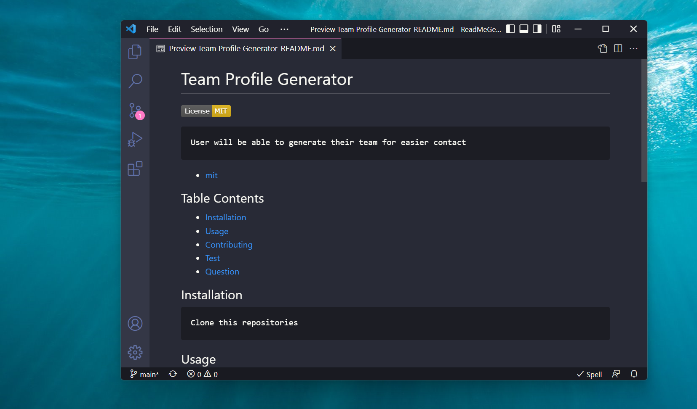

# ReadMe-Generator 

     
     When user tired of making your own landing page.
     This app will allow user to generate quality readme landing page.
- [mit](https://choosealicense.com/licenses/mit/)
## Table Contents

  - [Installation](#installation)
  - [Usage](#usage)
  - [Contributing](#contributing)
  - [Test](#test)
  - [Question](#question)
   

## Installation
     Installed nodejs
     Clone this Repository
     Installed npm package
    

## Usage
    In this project I used
    * Javascript
    * node.js
    * npm inquirer
    * VScode editor
    * git bash
   

## Contributing
    In this project every user can help improve this project at anytime.
    

## Test

<video  width="445" height="300" controls
 src="imagesandvideo/demo-readme.mp4" type="video/mp4">
</video>

## Question
- [phacharapol18](https://github.com/phacharapol18)
- <a href = "mailto:phacharapol18@gmail.com" target = "_blank">phacharapol18@gmail.com</a>
### Thank you
    
    